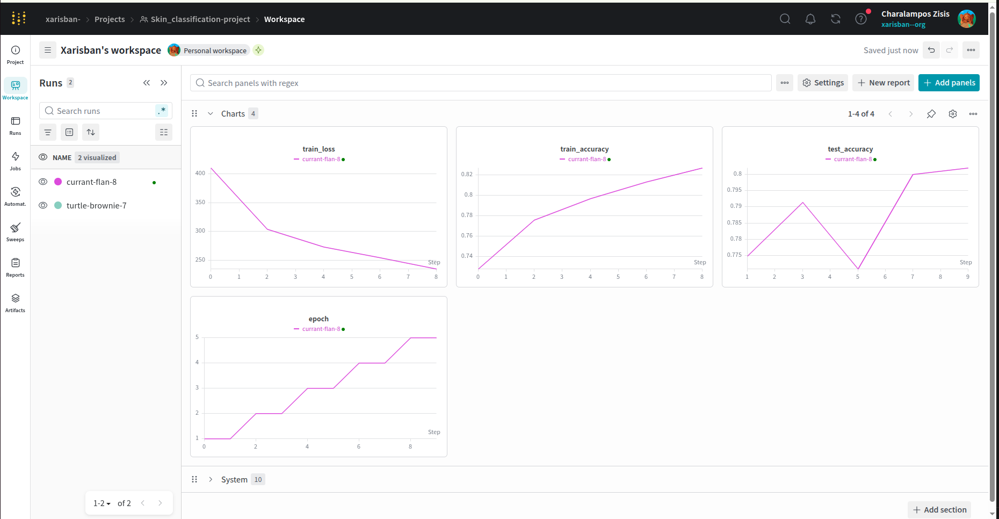
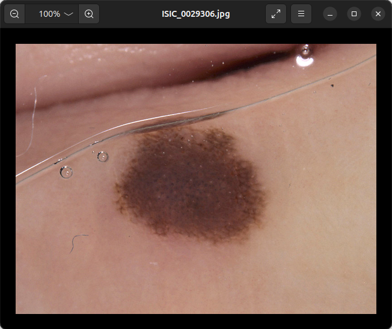
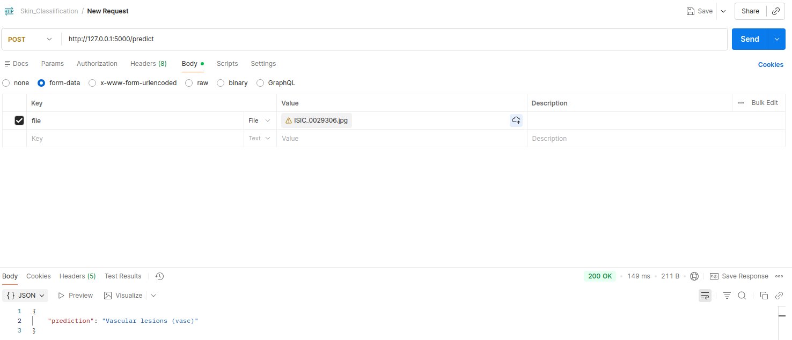

# Skin-Cancer-Classification-Problem

# Overview

This project implements a Skin carncer image classification model using deep learning techniques. The aim of this project is
training neural networks for automated diagnosis of pigmented skin lesion based on 10000 training images. The model is built with the  
Keras API from TensorFlow, Pytorch and is trained to classify images into predefined categories using ANN and transfer learning (MobileNet).  
Among the tested architectures, MobileNet demonstrated the highest performance, achieving an accuracy of 0.78 on the validation set.

## Technologies Used

- TensorFlow / Keras
- Pytorch
- MobileNet
- NumPy
- Matplotlib
- Scikit-learn

## Model Architechture 

- MobileNetV2 architecture fine-tuned for 7 classes.

- Training and validation with PyTorch.

- Model evaluation and logging with Weights & Biases (wandb)

- Flask API for image upload and real-time prediction.

- Supports uploading images via POST requests (tested with Postman).

## Experiment Tracking

Training metrics such as loss and accuracy are logged using , enabling easy monitoring and visualization of model performance.

## Flask API 

To demonstrate the model’s functionality, predictions can be made by sending image files via POST requests  
to the deployed Flask API. For example, the API endpoint /predict accepts image uploads through Postman,  
returning the classification result as JSON.

I chose the next image as an example to classify:
 

The result for the lesion classification is:

 

As we can see the result of that image is correct and classified as Vascular lession (vasc).
